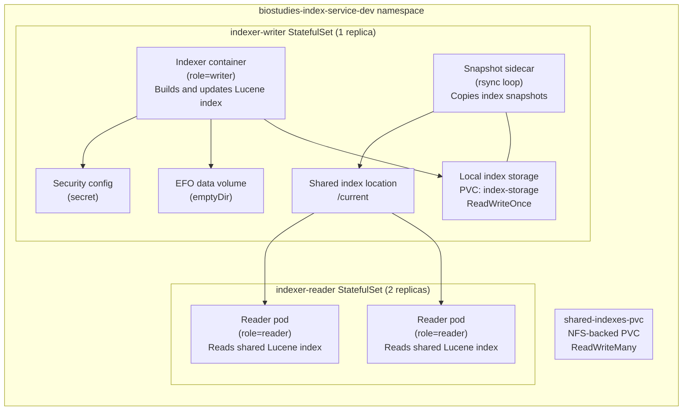

# Deployment architecture

The BioStudies Index Service is deployed in Kubernetes using separate writer and reader workloads.

The writer pod is responsible for building and updating the Lucene index. It keeps its main index
data on local persistent storage and uses a snapshot sidecar to synchronize published index
snapshots to shared NFS storage. Reader pods then consume the shared index from that storage.

## Kubernetes layout

## Roles

### Writer

The writer pod builds the index and maintains the authoritative local copy. A sidecar periodically
synchronizes snapshots to shared storage.

### Shared storage

The shared NFS volume provides a common read location for published index snapshots.

### Reader

Reader pods mount the shared index and use it for read-oriented access to the published Lucene data.