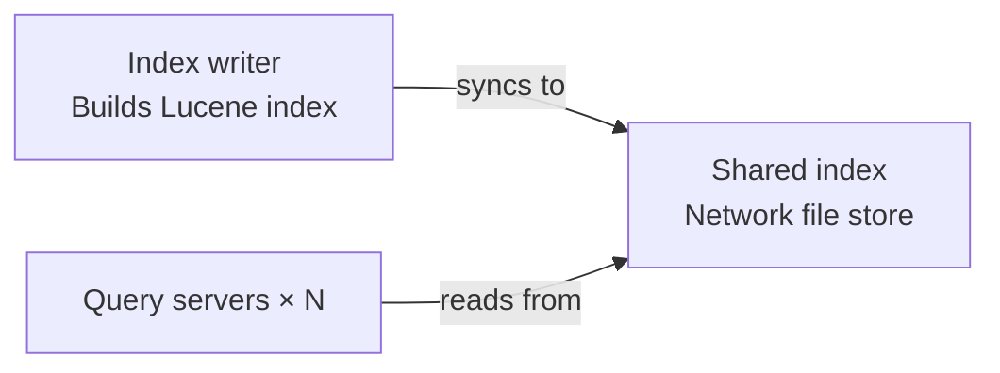

# Index Synchronization

This service uses a **single-writer, many-reader** model for Lucene indexes.

## Overview

There is only **one writer** responsible for creating and updating the Lucene index.
That writer is the **source of truth** for the index state.

Multiple **reader** instances can then consume the published index and answer search requests.
Readers do not modify the index. They only read from the synchronized copy.

This design keeps index updates deterministic while allowing search traffic to scale horizontally.

## Why this model exists

Lucene indexes are not designed to be concurrently written by multiple independent writers to the same shared index location.

Using a single writer gives us:

- a clear source of truth
- predictable index updates
- simpler synchronization logic
- safer deployment and recovery behavior

Using multiple readers gives us:

- better search throughput
- horizontal scaling for read traffic
- isolation between indexing and search workloads

## Synchronization model

The synchronization flow is:

1. The writer updates the primary Lucene index.
2. The writer publishes index snapshots to shared storage.
3. Reader instances consume the published snapshots from shared storage.
4. Search requests are served from the reader side.

Only the writer is allowed to modify index contents.
Readers always treat the synchronized index as read-only.

## Mental model

A useful way to think about the architecture is:

- **Writer = producer of truth**
- **Shared index storage = published snapshot**
- **Readers = consumers of truth**

The writer owns the authoritative index state.
Readers may be slightly behind the newest write, but they never diverge by modifying the index themselves.

## Benefits

This approach gives us:

- **consistency**: one authoritative writer
- **scalability**: many readers can serve search requests
- **operational simplicity**: the index update path is isolated
- **predictable recovery**: the published snapshot can be rebuilt from the writer if needed

## Search consistency

Search results are based on the latest synchronized index available to the readers.
Because synchronization is asynchronous, there can be a short delay between:

- an index update being written by the writer, and
- that update becoming visible to readers

This is expected behavior and is part of the design.

## Summary

In short:

- **1 writer** builds and updates the Lucene index
- **N readers** serve search requests from the shared published index
- the writer is the **only source of truth**
- readers are **read-only consumers** of that truth