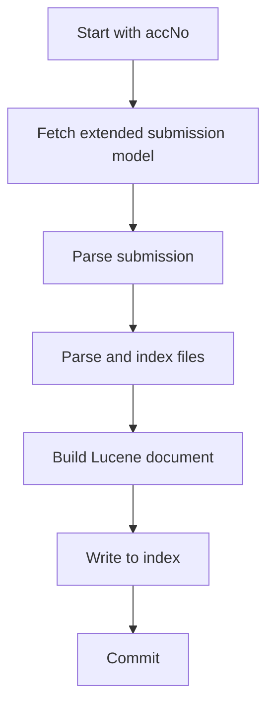

# BioStudies Index Service

The BioStudies Index Service is responsible for transforming submission data into searchable Lucene
index entries. It takes a submission accession, retrieves the associated submission model, processes
submission and file information, and writes the result into the index.

This page gives a high-level overview of the service, the main indexing flow, and the kinds of data
that are stored and made searchable.

## Overview

The index service exists to keep BioStudies submissions searchable and up to date. It combines
submission metadata and file-related information into indexed documents that can later be queried by
search components.

At a high level, the service works by loading submission data, parsing the relevant fields, building
index-ready documents, and persisting them into Lucene.

## Architecture

The indexing pipeline is built around a few main responsibilities: retrieving submission data,
parsing submission content, processing file metadata, constructing Lucene documents, and writing
those documents to the index.

Each part of the pipeline has a focused role, which keeps the indexing process modular and easier to
maintain.

## Indexing process

Indexing starts with a submission accession number. From there, the service retrieves the full
submission model and begins transforming it into indexable content.

The general flow is:

This sequence represents the typical path a submission follows before becoming searchable.

The indexing and searching processes write and read from several Lucene indexes. For more details,
please refer to the [Lucene indexes](lucene-indexes.md) documentation.

## Indexed content

The service indexes both submission-level and file-level information. Submission fields provide the
core searchable metadata, while file processing contributes additional attributes and derived
values.

In practice, this means the resulting document can reflect not only the submission itself, but also
relevant details extracted from associated files.

We offer a configurable way to control which fields are indexed and how they are processed. To see
more
details, please refer to the [Collections Registry](collections-registry.md) documentation.

## Commit and transaction behavior

Index updates are committed after the document has been written, depending on how the indexing
operation is invoked. This allows the service to support both immediate and deferred commit
workflows.

This separation is useful when multiple submissions are processed together and committed as a batch.

## Error handling

Indexing is designed to continue collecting useful state even when some file-related work fails.
Errors are handled in a way that allows the service to report what happened without always stopping
the entire process immediately.

This makes the service more resilient during large or partially inconsistent indexing runs.

## Related documentation

If you want to explore the system in more detail, these pages are a good next step:

- [Deployment](deployment.md) — how the service is deployed in Kubernetes
- [Parsers](parsers.md) — how submission data is parsed
- [Analyzers](analyzers.md) — how text is analyzed for indexing
- [Lucene indexes](lucene-indexes.md) — how the indexes are organized and used
- [Collections registry](collections-registry.md) — how indexed fields are configured